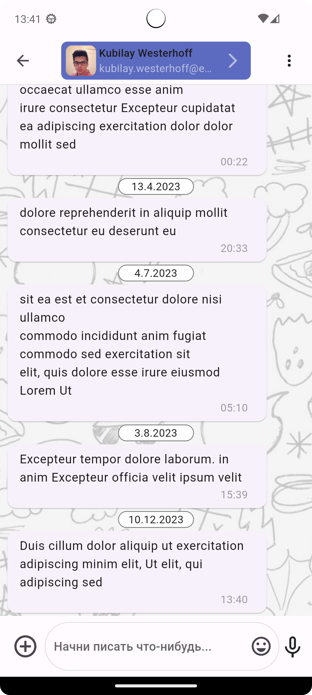

# messenger_imitation_project

# Описание проекта

**Проект создавался, как тестовое задание для собеседования. Суть задания: сделать имитацию
мессенджера с характерными внешними чертами, с возможностью поступления новых сообщений в реальном
времени от списка контактов. В поле чата осуществить возможность ответа на сообщения, так
же возможность просмотра контактных данных собеседника на отдельном экране. Фрэймворк Flutter.**

|          Список контактов           |      Экран чата с собеседником      |         Информация о контакте         | 
|:-----------------------------------:|:-----------------------------------:|:-------------------------------------:|
|  |  |  | 

|            Ответ собеседнику            | Прикрепление файлов - только заглушка! |   Новые сообщения от списка контактов    |
|:---------------------------------------:|:--------------------------------------:|:----------------------------------------:|
|  |  |   |